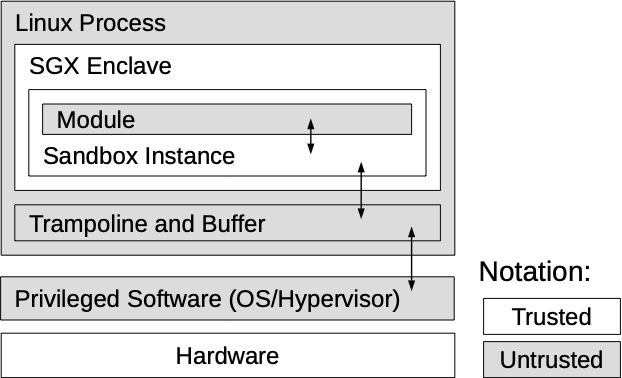
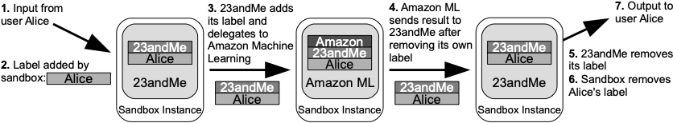

Ryoan: A distributed sandbox for untrusted computation on secret data
=====================================================================

Data-processing services are widely available on the Internet.  Individual users
can conveniently access them for tasks including image editing (e.g., Pixlr),
tax preparation (e.g., TurboTax), data analytics (e.g., SAS OnDemand) and even
personal health analysis (23andMe).  However, user inputs to such services are
often sensitive, such as tax documents and health data, which creates a dilemma
for the user. In order to leverage the convenience and expertise of these
services, the user must disclose sensitive data.  If the user wants to keep
their data secret, they either have to give up using the services or hope that
they can be trusted---that their service software will not leak data.

Ryoan, is a distributed sandbox that forces data-processing services to keep
user data secret, without trusting the service's software stack.  Ryoan provides
a sandbox to confine individual data-processing modules and prevent them from
leaking data. Then it uses trusted hardware to allow a remote user to verify the
integrity of individual sandbox instances and protect their execution.

-------------------------------------------------------------------------------

A key enabling technology for Ryoan is hardware enclave-protected execution
(e.g., Intel's software guard extensions (SGX)), a hardware primitive that uses
trusted hardware to protect a user-level computation from potentially malicious
privileged software.

Ryoan's security goal is simple: prevent leakage of secret data. However,
  confining services over which the user has no control is challenging without a
  centralized trusted platform.  We make the following contributions:

 * A new execution model that allows mutually distrustful parties to process
 sensitive data in a distributed fashion on untrusted infrastructure.

 * The design and implementation of a prototype distributed sandbox that
 confines untrusted code modules (possibly on different machines) and enforces
 I/O policies that prevent leakage of secrets.

 * Several case studies of real-world application scenarios to demonstrate how
 they benefit from the secrecy guarantees of Ryoan, including an image processing
 system, an email spam/virus filter, a personal health analysis tool, and a
 machine translator.

 * Evaluation of the performance characteristics of our prototype by measuring
 the execution overheads of each of its building blocks: the SGX enclave,
 confinement, and checkpoint/rollback.

-------------------------------------------------------------------------------

Ryoan confines a directed acyclic graph of communicating modules. Each module is
a piece of application logic that processes user data while managing its own secrets.

A single instance of the Ryoan sandbox:

Ryoan uses a system of labels to track the data stakeholders of messages as they
travel from instance to instance. Messages are encrypted so that only other
Ryoan instances can decrypt them. Steakholders are only allowed remove their own
lables, and output messages are keep all un-removed labels from the input making
it possible to delegate computation to modules outside of their control.
Ryoan will only send completely unlabeld messages to users, so a provider can
output a labeld message that contains proider secrets with the assurance that
the response must pass through another of their moduled before it can be
communicated outside of the dsitributed sandbox.

An example where 23AndMe delegates work to Amazon, then filters the results
making sure thye are clean of 23AndMe's secrets before sending the final
response to the user:

--------------------------------------------------------------------------------

Ryoan uses many tecchniques to confine applicationsd while remaining programable.
for instance:
  * Input is consumed by the sandbox all at once so that read patterns do not leak
    information. Ryoan buffers input so that applications can use familiar stream
    abstractions.
  * Output is buffered and padded/truncated to a fixed funtionof the input size.
    This prevents the confined code from using the write pattern or size to
    communicate secrets outside of the sandbox.
  * Encryption/decryption of the input and output are done automatically by Ryoan
    out of control of the application
  * Communication patterns are fixed at initialization time and are visible to
    users so that providers cannot create long chains of leaky enclaves.

Please take a look at our publications for more details about the design:
 * Tyler Hunt, Zhiting Zhu, Yuanzhong Xu, Simon Peter, and Emmett Witchel.
 Ryoan: A distributed sandbox for untrusted computation on secret data. In
 [OSDI 2016 (best paper awardee!)](https://www.usenix.org/conference/osdi16/technical-sessions/presentation/hunt)
 and [TOCS Dec 2018](https://dl.acm.org/doi/10.1145/3231594).

Ryoan is based on Google's
[Native Client](https://developer.chrome.com/native-client). Native Client
(NaCl) is a software sandbox that allows Ryoan to confine untrusted code. While
NaCl is usually connected to the Chrome browser it has been modified here to run
as a standalone process.

Ryoan is designed to run in SGX, but this prototype does not. Key features of
Ryoan such as checkpoint restore depend on SGX version 2 capabilities which have
yet to be released. To support execution in SGX Ryoan links NaCl to a modified
version of eglibc. Eglibc has been augmented here with marshalling code for all
system calls (take a look at `eglibc/sgx_syscall_interpos`).

Project Structure
-----------------
 - [`/native_client`](native_client) the Ryoan runtime
 - [`/naclports`](naclports) applications ported to Ryoan, and machinery to
 compile them using the nacl toolchain
 - [`/eglibc`](eglibc) libc modified to be compatible with SGX.
 - [`/naclports`](naclports) applications ported to Ryoan, and machinery to
 compile them using the nacl toolchain
 - [`/apps`](apps) workloads and external machinery required to make Ryoan work.
 E.g., IPC plumbing for pipelines, client programs.
 - [`/linux`](linux) linux kernel patches for SGX performance modeling

Prerequisites
--------------
  - Ubuntu 16.04 (may build on later versions but not tested)
  - Apt packages: `build-essential` `pv`

Configure
----------
Run `J=${Jobs} ./bootstrap.sh` in the root directory. This will unpack
`ryoan_env.tar.xz` and recursively configure other directories. This will also
build eglibc since it is required to configure other parts of Ryoan. The
environment variable `J` is passed directly to the `make` call for eglibc.

Build
-----
Each piece of Ryoan has a make file that will do the right thing after the
project is configured. Make commands should be run in the following order; some
pieces expect to be able to find headers generated by others.
  1. `cd native_client && make J=${n_jobs}` (make calls scons here so `-j` will
     do nothing).
  2. `cd naclports && make -j${n_jobs}`
  2. `cd apps && make -j${n_jobs}`
     do nothing).

Run
---
Running Ryoan requires a client program, a server program, and a pipeline
specification that details what modules should be loaded. These can all be found
in [`/apps`](apps). We've provided the scripts: `run_*_benchmark.sh` which
demonstrate how pipelines should be run and interacted with.
